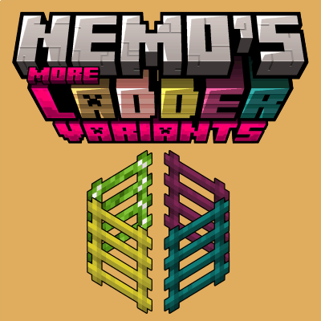

#  
&emsp;&emsp;&emsp; Nemo’s More Ladder Variants  <a title="Nemo’s More Ladder Variants on Curseforge" href="https://www.curseforge.com/minecraft/mc-mods/nemos-more-ladder-variants"></a> 

>   
>  A simple mod adding wood variants for Minecraft's Ladder Block as a standalone version from the Ladder variants added by <a href="https://www.modrinth.com/mod/nemos-carpentry">Nemoʼs Carpentry</a>.       
>  <!--

<h5>Show in-game example image</h5>
  CAPTION:PLACEHOLDER
-->   
   

###  Compatibility

<table>
  <thead>
    <tr>
      <td><strong>Minecraft</strong></td>
      <td>
        <a href="https://modrinth.com/mod/nemos-more-ladder-variants/versions?g=1.20.1"><code>1.20.1</code></a> 
        <a href="https://modrinth.com/mod/nemos-more-ladder-variants/versions?g=1.21&g=1.21.1"><code>1.21(.1)</code></a>, <a href="https://modrinth.com/mod/nemos-more-ladder-variants/versions?g=1.21.4&g=1.21.5&g=1.21.6&g=1.21.7&g=1.21.8&g=1.21.9&g=1.21.10&g=1.21.11"><code>1.21.4</code>~<code>1.21.11</code></a> 
        <a href="https://modrinth.com/mod/nemos-more-ladder-variants/versions?g=26.1"><code>26.1</code></a>
      </td>
    </tr>
  </thead>
  <tbody>
    <tr>
      <td><strong>Mod Loaders</strong></td>
      <td><a href=Language"https://fabricmc.net/use/installer/"><code>Fabric Loader</code></a></td>
    </tr>
  </tbody>
  <thead>
    <tr>
      <td><strong>Requires</strong></td>
      <td>
        <a href="https://modrinth.com/mod/fabric-api"><code>Fabric API</code></a> 
        <a href="https://modrinth.com/mod/more-stick-variants"><code>More Stick Variants</code></a>
      </td>
    </tr>
  </thead>
</table>
 

###  Translations

|Language|Translator|
|--|--|
|English||
|German||
|French|@[Peperehobbits01](/../../../../Peperehobbits01) with [PR #2](../../pull/2), added in [`1.0.7`](./CHANGELOG_history.md#1.0.7)|
|Ukrainian|@[StarmanMine142](/../../../../StarmanMine142) with [PR #4](../../pull/4), added in [`1.0.10`](./CHANGELOG_history.md#1.0.10)|

> [!NOTE]
> > Want to help translate? If you can, please open a PR to the **default branch** [`1.21(.1)`](../../tree/1.21(.1)).  
> > Otherwise, simply send your translation via email (contact@pnku.de) or join the [Discord](https://discord.lieonlion.dev).

 

  

### Versions

<!--CHANGELOG:START-->

#### 1.1.1[*](#footnote-*):
- `26.1`: Update to <ins>26.1</ins>

  
License update to [`CC-BY-NC-SA-4.0`](https://creativecommons.org/licenses/by-nc-sa/4.0/) (previously [`MIT`](https://choosealicense.com/licenses/mit))

<h2><ins>Download 1.0.11 + 1.21.4(-11)</ins>:&#x200A;

</h2>

<!--CHANGELOG:END-->

> <strong>*</strong>: Most recent version  
> _`The version above is automatically updated with the newest release and only after it has been successfully published.`_

> [!TIP]
> > Looking for changes of previous versions?  
> > You can find them in the [changelog history](./CHANGELOG_history.md).

---
#### Support/Contact
- Suggestions? Questions? Bug reports?  
  Feel free to [open an issue](/../../issues)!  
  &nbsp;  
  You can also contact me via email at [contact@pnku.de](mailto:contact@pnku.de) or join the [Discord](https://dsc.lieonlion.dev) and contact me there.